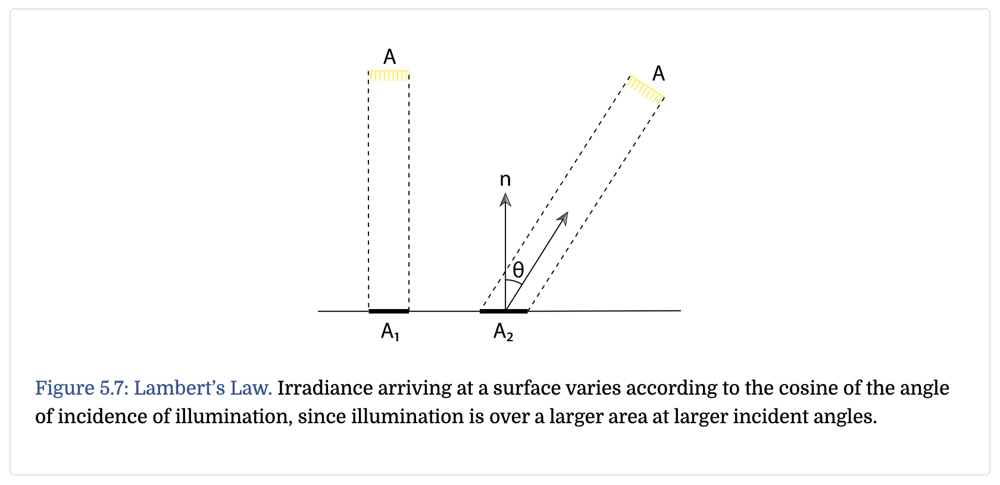
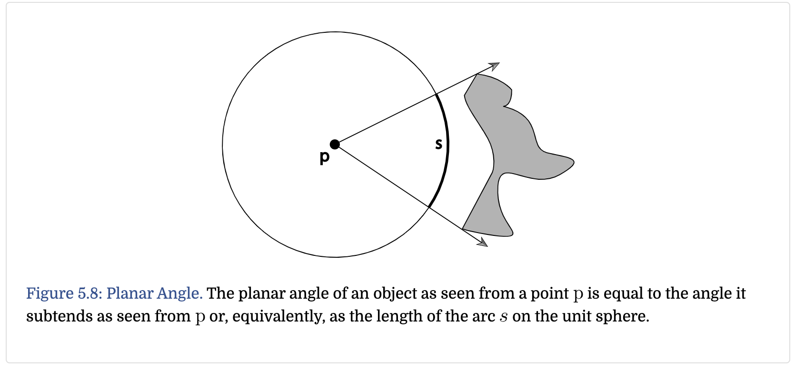
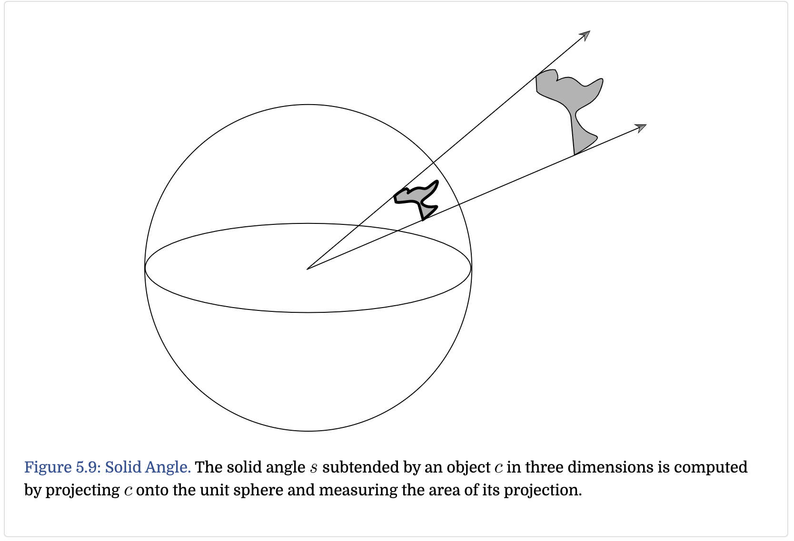

Radiometry provides a set of mathematical tools that describe light **propagation** and **reflection**.

Its basic quantitie are:

* flux
* irradiance / radiant exitance
* intensity
* radiance

## Energy

Begin with energy, which is measured in joules ($$ J $$). A photon at wavelength $$\lambda$$ carries energy
$$
Q = \frac{hc}{\lambda}
$$
where $$c$$ is the speed of light, $$ h $$ is Planck's constant, $$ h \approx 6.626 \times 10^{-34} m^2 kg/s $$.

**Energy measures work over some period of time.**

## Flux / Power

Flux is the total amount of energy passing through a surface or region of space per unit time. By taking the limit of differential energy per differential time:
$$
\Phi = \lim_{\Delta t \to 0}\frac{\Delta Q}{\Delta t} = \frac{dQ}{dt}
$$
Conversely, given a flux as a function of time, we can integrate over a range of times:
$$
Q = \int_{t_0}^{t_1}\Phi(t)dt
$$

## Irradiance and Radiant Exitance

the area density of flux arriving at a surface: $$ E = \Phi / A$$

so $E$ is the power per unit area

more generally, $$E(p) = \lim_{\Delta A \to 0} \frac{\Delta \Phi(p)}{\Delta A} = \frac{d \Phi(p)}{dA}$$

integrate this formular:
$$
\Phi = \int_{A} E(p) dA
$$
Lambert's Law:

$$
E_2 = \frac{\Phi \cos{\theta}}{A_2}
$$

## Solid Angle and Intensity

2D case:

project the shaded object onto that circle, the arc $$ s $$ will be covered (the same as the angle $$\theta$$)

3D case:

project it onto the sphere, the area will be covered, which is the same as **solid angle**. use $$\omega$$ to denote solid angle (normalized vector)
